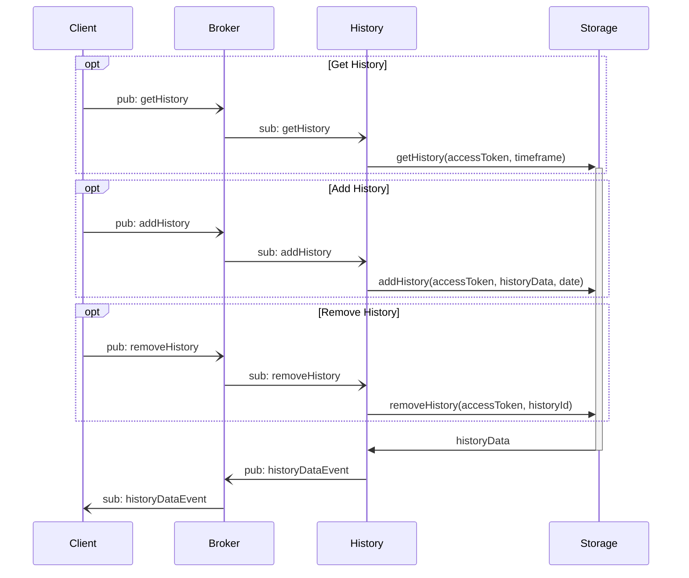

# History events

```mermaid
sequenceDiagram
    opt Get History
        Client-)Broker: pub: getHistory
        Broker-)History: sub: getHistory
        History->>+Storage: getHistory(accessToken, timeframe)
    end
    opt Add History
        Client-)Broker: pub: addHistory
        Broker-)History: sub: addHistory
        History->>Storage: addHistory(accessToken, historyData, date)
    end
    opt Remove History
        Client-)Broker: pub: removeHistory
        Broker-)History: sub: removeHistory
        History->>Storage: removeHistory(accessToken, historyId)
    end
    Storage->>-History: historyData
    History-)Broker: pub: historyDataEvent
    Broker-)Client: sub: historyDataEvent
```
