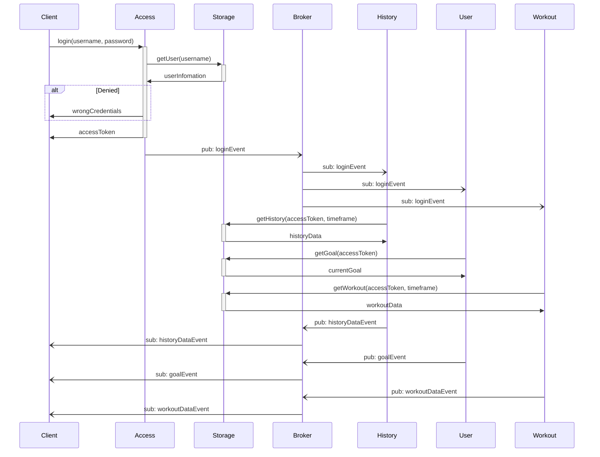

# Login Sequence Diagram

```mermaid
sequenceDiagram
    Client->>+Access: login(username, password)
    Access->>+Storage: getUser(username)
    Storage->>-Access: userInfomation
    alt Denied
        Access->>Client: wrongCredentials
    end
    Access->>-Client: accessToken
    Access-)Broker: pub: loginEvent
    Broker-)History: sub: loginEvent
    Broker-)User: sub: loginEvent
    Broker-)Workout: sub: loginEvent
    History->>+Storage: getHistory(accessToken, timeframe)
    Storage->>-History: historyData
    User->>+Storage: getGoal(accessToken)
    Storage->>-User: currentGoal
    Workout->>+Storage: getWorkout(accessToken, timeframe)
    Storage->>-Workout: workoutData
    History-)Broker: pub: historyDataEvent
    Broker-)Client: sub: historyDataEvent
    User-)Broker: pub: goalEvent
    Broker-)Client: sub: goalEvent
    Workout-)Broker: pub: workoutDataEvent
    Broker-)Client: sub: workoutDataEvent
```
