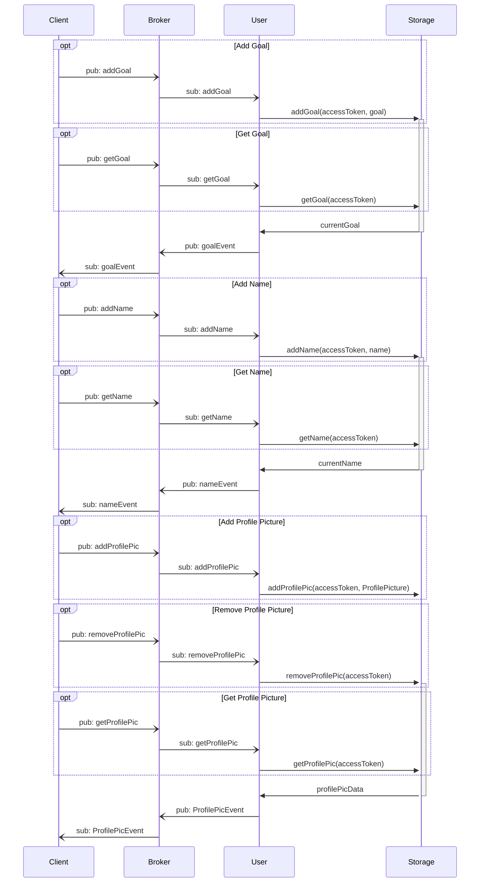

# User events

```mermaid
sequenceDiagram
    opt Add Goal
        Client-)Broker: pub: addGoal
        Broker-)User: sub: addGoal
        User->>+Storage: addGoal(accessToken, goal)
    end
    opt Get Goal
        Client-)Broker: pub: getGoal
        Broker-)User: sub: getGoal
        User->>Storage: getGoal(accessToken)
    end
    Storage->>-User: currentGoal
    User-)Broker: pub: goalEvent
    Broker-)Client: sub: goalEvent
    
    

    opt Add Name
        Client-)Broker: pub: addName
        Broker-)User: sub: addName
        User->>+Storage: addName(accessToken, name)
    end
    opt Get Name
        Client-)Broker: pub: getName
        Broker-)User: sub: getName
        User->>Storage: getName(accessToken)
    end
    Storage->>-User: currentName
    User-)Broker: pub: nameEvent
    Broker-)Client: sub: nameEvent

    opt Add Profile Picture
        Client-)Broker: pub: addProfilePic
        Broker-)User: sub: addProfilePic
        User->>+Storage: addProfilePic(accessToken, ProfilePicture)
    end
    opt Remove Profile Picture
        Client-)Broker: pub: removeProfilePic
        Broker-)User: sub: removeProfilePic
        User->>+Storage: removeProfilePic(accessToken)
    end
    opt Get Profile Picture
        Client-)Broker: pub: getProfilePic
        Broker-)User: sub: getProfilePic
        User->>Storage: getProfilePic(accessToken)
    end
    Storage->>-User: profilePicData
    User-)Broker: pub: ProfilePicEvent
    Broker-)Client: sub: ProfilePicEvent
```
