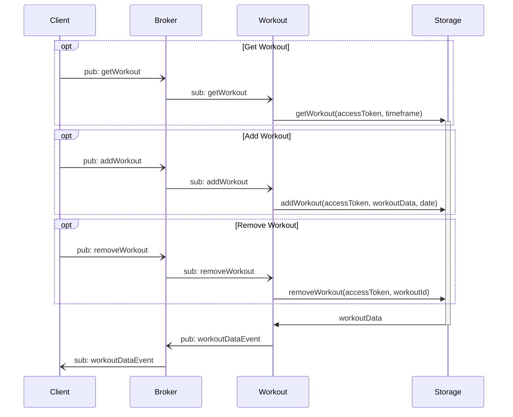

# Workout events

```mermaid
sequenceDiagram
    opt Get Workout
        Client-)Broker: pub: getWorkout
        Broker-)Workout: sub: getWorkout
        Workout->>+Storage: getWorkout(accessToken, timeframe)
    end
    opt Add Workout
        Client-)Broker: pub: addWorkout
        Broker-)Workout: sub: addWorkout
        Workout->>Storage: addWorkout(accessToken, workoutData, date)
    end
    opt Remove Workout
        Client-)Broker: pub: removeWorkout
        Broker-)Workout: sub: removeWorkout
        Workout->>Storage: removeWorkout(accessToken, workoutId)
    end
    Storage->>-Workout: workoutData
    Workout-)Broker: pub: workoutDataEvent
    Broker-)Client: sub: workoutDataEvent
```
